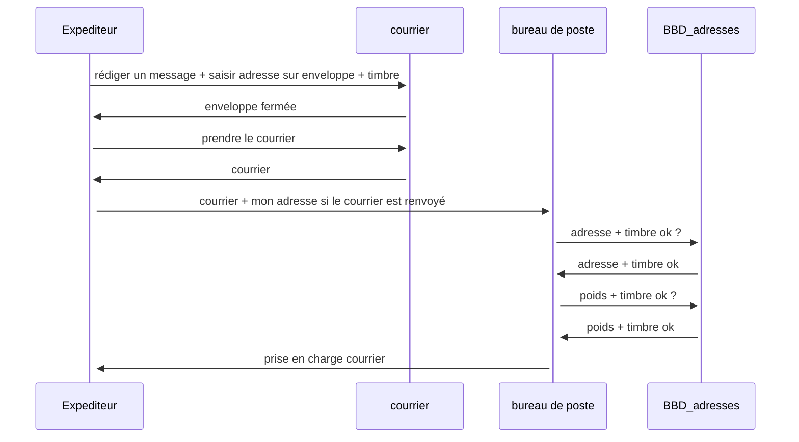
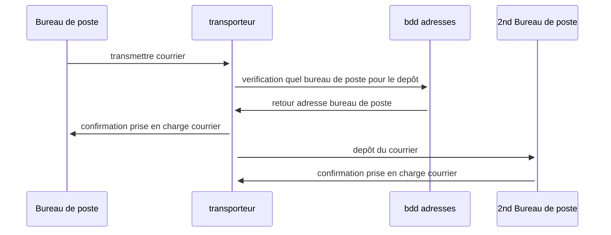
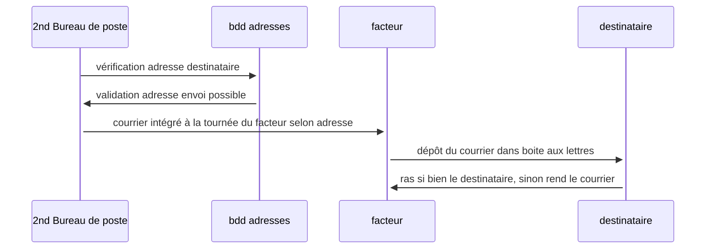
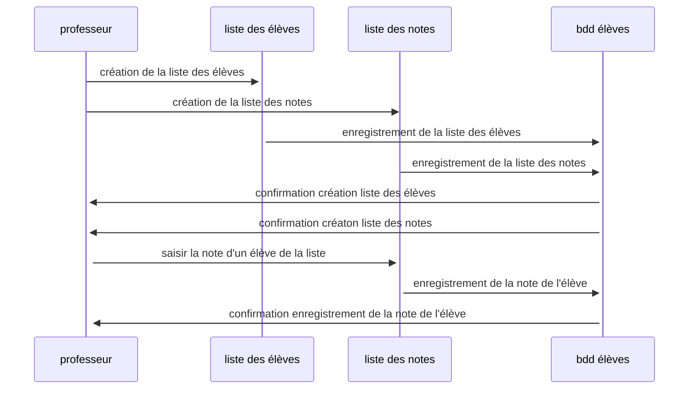

# Envoi courrier

```mermaid
sequenceDiagram
    Expediteur->>+courrier: rédiger un message + saisir adresse sur enveloppe + timbre
    courrier->>+Expediteur: enveloppe fermée
    Expediteur->>+courrier: prendre le courrier
    courrier->>+Expediteur: courrier
    Expediteur->>+bureau de poste : courrier + mon adresse si le courrier est renvoyé
    bureau de poste->>+ BBD_adresses : adresse + timbre ok ?
    BBD_adresses->>+bureau de poste: adresse + timbre ok
    bureau de poste->>+ BBD_adresses : poids + timbre ok ?
    BBD_adresses->>+bureau de poste: poids + timbre ok
    bureau de poste->>+Expediteur: prise en charge courrier 
```

---

```mermaid
sequenceDiagram
    Bureau de poste->>+ transporteur: transmettre courrier
    transporteur->>+ bdd adresses : verification quel bureau de poste pour le depôt
    bdd adresses->>+ transporteur : retour adresse bureau de poste
    transporteur->>+ Bureau de poste : confirmation prise en charge courrier
    transporteur->>+ 2nd Bureau de poste : depôt du courrier 
    2nd Bureau de poste->>+ transporteur : confirmation prise en charge courrier
   
```

```mermaid
sequenceDiagram
    2nd Bureau de poste->>+ bdd adresses : vérification adresse destinataire
    bdd adresses->>+ 2nd Bureau de poste : validation adresse envoi possible
    2nd Bureau de poste->>+ facteur : courrier intégré à la tournée du facteur selon adresse
    facteur->>+ destinataire : dépôt du courrier dans boite aux lettres
    destinataire->>+ facteur : ras si bien le destinataire, sinon rend le courrier

```

```mermaid
sequenceDiagram
    professeur->>+ liste des élèves : création de la liste des élèves
    professeur->> liste des notes : création de la liste des notes
    liste des élèves->>+ bdd élèves : enregistrement de la liste des élèves
    liste des notes->>+ bdd élèves : enregistrement de la liste des notes
    bdd élèves->>+ professeur : confirmation création liste des élèves
    bdd élèves->>+ professeur : confirmation créaton liste des notes
    professeur->>+ liste des notes : saisir la note d'un élève de la liste
    liste des notes->>+ bdd élèves : enregistrement de la note de l'élève
    bdd élèves->>+ professeur : confirmation enregistrement de la note de l'élève
    
```
    
    